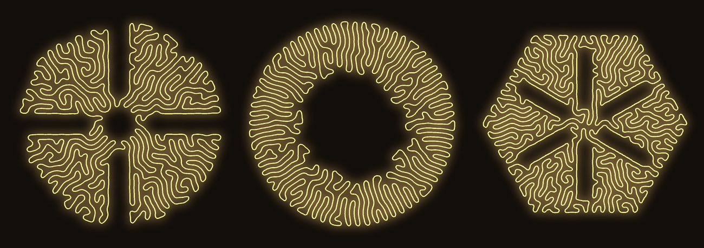
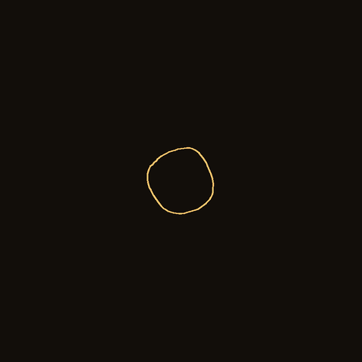
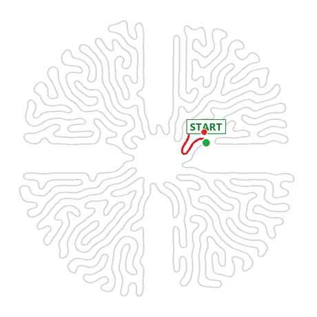
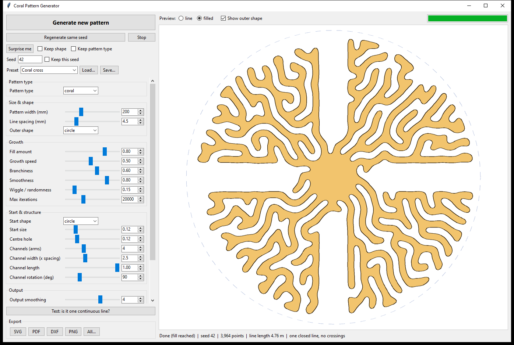
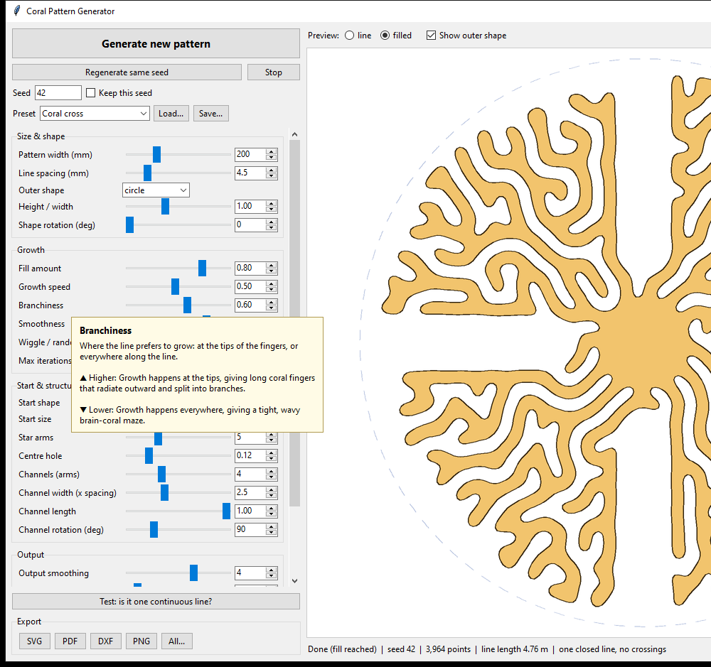
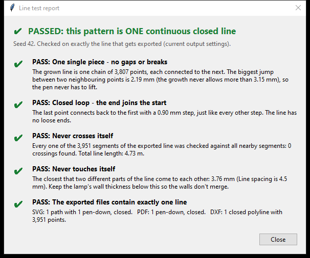
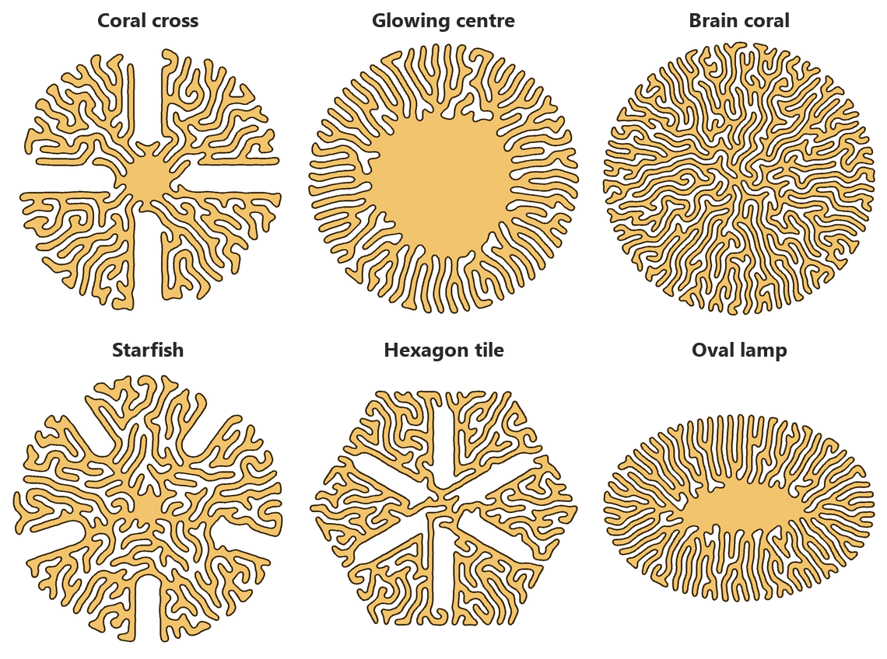

# Coralline

**Generative coral patterns for lamps, drawn as one continuous line.**

Coralline grows organic coral and brain-coral patterns with a *differential growth* simulation.
Every pattern is **one single closed line that never crosses or touches itself**, ready to be
extruded into a 3D-printed lamp wall. Press a button, get a new pattern, and export it as
SVG, PDF, DXF or PNG in real millimetres.



<p align="center">
  
  &nbsp;
  
</p>
<p align="center"><em>Left: a pattern growing. Right: the built-in test traces the entire pattern in one pen stroke.</em></p>

---

## Features

- **One click, new pattern.** Every press of *Generate* gives a unique pattern. A **seed** number lets you rebuild any favourite exactly.
- **Always one continuous line.** It's one closed loop with no crossings, no touching and no loose ends. That's what you need for a lamp wall, a pen plotter or a laser cutter.
- **Built-in proof.** The *Test* button traces the whole line and checks the exported files (see below).
- **Lots of control.** Size, line spacing, outer shape, fill, branchiness, smoothness, randomness, start shape, centre hole and radial channels.
- **Real-size exports.** SVG, PDF, DXF (for CAD) and PNG, all in millimetres.
- **Watch it grow** live in the preview.
- **Built-in help.** Rest the mouse on any setting for 2 seconds to see what it does and what happens when you raise or lower it.
- **Presets**, plus saving and loading your own.
- **Batch mode** to make dozens of patterns from the command line.

## Quick start

Requires **Python 3.9+**. Tested on Windows 10 with Python 3.12.

```bash
git clone https://github.com/<noob47-E>/coralline.git
cd coralline
pip install -r requirements.txt
python app.py
```

On Windows you can also just double-click **`run_app.bat`**. The first time, it installs the
packages it needs (numpy, scipy, Pillow).

**Want a program that runs without Python?** Run `build_exe.bat` once. It creates
`dist\CoralPatternGenerator.exe`, a single file you can copy to any Windows PC.

## The app



1. Pick a **Preset** or set the sliders yourself.
2. Press **Generate new pattern** and watch it grow. It usually takes 5–20 seconds.
3. Don't like it? Press Generate again. Like it? Note the **seed**: *Regenerate same seed* rebuilds exactly the same pattern.
4. Adjust **Output smoothing** and **Line width**. These update the finished pattern instantly, without regrowing it.
5. Press **Test: is it one continuous line?** if you want proof.
6. Export as **SVG, PDF, DXF, PNG** or **All...** (*All* also saves the settings as JSON, so you can reproduce the pattern).

### Help for every setting

Rest the mouse on any setting or button for **2 seconds**. A box explains what it does and what
happens when you turn it **higher** or **lower**.



## Proof: one continuous line

The **Test** button proves the pattern is a single line in two ways:

1. **Visually.** A pen starts at the green **START** dot and traces the entire pattern without lifting, returning to **START = END**. The colour changes along the way so you can follow the path (animation at the top of this page).
2. **Measured.** A report checks five things on *exactly* the line that gets exported:



| Check | What it verifies |
|---|---|
| One single piece | No gaps: every point connects to the next. |
| Closed loop | The end of the line joins its start, so there are no loose ends. |
| Never crosses itself | Every segment is checked against all nearby segments. |
| Never touches itself | Measures the closest distance between different parts of the line. This is your maximum wall thickness. |
| Files contain one line | Builds the real SVG, PDF and DXF files and confirms that each contains exactly one closed path. |

The test fails correctly on broken lines (gaps, loose ends, extra loops, crossings). The batch tool
runs it automatically on every pattern it makes.

## Presets



Presets are plain JSON files in [`presets/`](presets). Use *Save...* in the app to add your own.

## Settings

| Setting | What it does |
|---|---|
| Pattern width (mm) | Overall size of the pattern. |
| Line spacing (mm) | Gap between neighbouring lines, which is the width of the "fingers". Smaller means more detail and a slower run. |
| Outer shape / Height-width / Rotation | Circle, ellipse, triangle, square, hexagon or octagon, which you can stretch and rotate. |
| Fill amount | How much of the shape fills up before growth stops. Lower leaves open space. |
| Growth speed | Faster finishes sooner but is slightly rougher. |
| Branchiness | High gives long branching coral fingers. Low gives a dense brain-coral maze. |
| Smoothness | High gives round, calm curves. Low gives crinkly, busy curves. |
| Wiggle / randomness | Extra irregularity. |
| Start shape | **circle / star** grow outward from the centre. **ring** grows inward from the edge and leaves an open, glowing centre. |
| Centre hole | Keeps a round empty area in the middle, e.g. for the bulb. |
| Channels (arms) | Straight empty channels radiating from the centre, with adjustable width, length and rotation. |
| Output smoothing | Rounds the exported line (0 = raw). |
| Point spacing (mm) | Detail of the exported line: smaller gives more points and bigger files. |

## Exports and 3D workflow

All exports are one closed line at real size in millimetres. Example files for seed 42 are in [`examples/`](examples).

| Format | Use it for |
|---|---|
| **SVG** | Blender, Illustrator, Inkscape, Rhino, pen plotters. |
| **DXF** | Fusion 360, AutoCAD and other CAD, laser cutters. It's an R12 file with one closed polyline in mm. |
| **PDF** | Printing, or as a vector file for graphic tools. |
| **PNG** | Previews and sharing. Line or filled style, 150–1200 DPI. |

- **Blender**: *File → Import → Scalable Vector Graphics (.svg)*. Set *Extrude* on the curve, or convert it to a mesh and add a *Solidify* modifier. Check the imported size, because Blender uses its own SVG scale.
- **Fusion 360**: *Insert → Insert DXF* onto a sketch plane, then *Extrude* or *Thicken*.

## Batch mode

```bash
python cli.py --count 10 --out patterns
python cli.py --preset "presets/Coral cross.json" --seed 42 --formats svg,dxf
python cli.py --set channels=6 --set hole=0.15 --set smoothing=4 --count 5
```

Each pattern is saved with its settings JSON, and the line test result is printed.

## How it works

The pattern is a closed chain of points that "grows" inside a boundary. On every step:

1. **Smoothing**: each point is pulled toward the midpoint of its two neighbours.
2. **Springs**: neighbouring points keep a fixed distance along the line.
3. **Repulsion**: points from different parts of the line push apart when closer than one line spacing. A `scipy` k-d tree keeps this fast.
4. **Walls**: the outer shape, centre hole and channels push points away.
5. **Growth**: new points are inserted, preferring free space (low pressure) and curved tips (branchiness). Long edges are split and tiny ones merged.

The line keeps getting longer but has limited room, so it buckles and folds into coral fingers.
Repulsion keeps separate parts of the line apart, so it never crosses itself. The random seed
controls the tiny differences that make every pattern unique. A new seed gives a new pattern, and
the same seed gives the same pattern.

For export, the line is resampled, smoothed and written as Catmull-Rom → cubic Bézier curves
(SVG / PDF) or a dense closed polyline (DXF).

## Project structure

```
app.py          desktop app (Tkinter)
growth.py       differential-growth simulation
geometry.py     smoothing, resampling, crossing check
exporters.py    SVG / PDF / DXF / PNG writers (no extra dependencies)
linetest.py     the "one continuous line" proof
cli.py          batch generator
presets/        ready-made settings
examples/       example exports (seed 42)
docs/images/    README images
run_app.bat     double-click launcher (Windows)
build_exe.bat   builds a standalone .exe with PyInstaller
```
